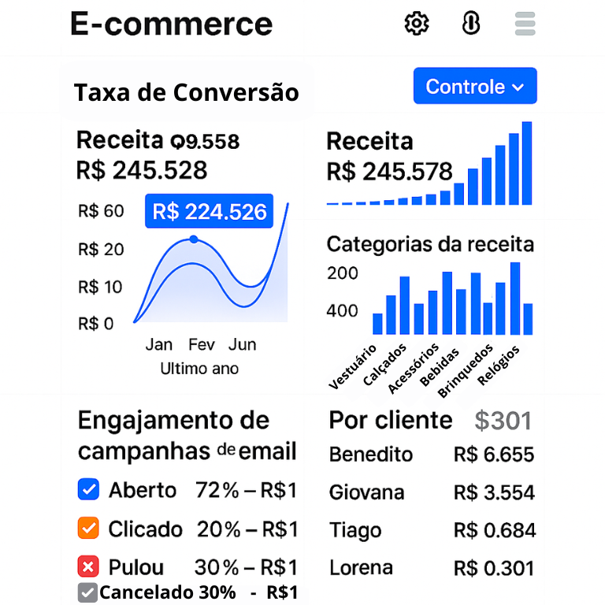

📖 You’re reading the English version of this project description.  
🇧🇷 Versão em Português disponível aqui: [README.md](README.md)

---

# 🛒 Smart Automation for E-commerce

### Cart Recovery and Customer Retention 🚀


-blue)


---

## 🧭 Quick Navigation

- [📝 Project Overview](#-project-overview)
- [🔍 Problem Addressed](#-problem-addressed)
- [🎯 Automation Goals](#-automation-goals)
- [🎯 Target Audience](#-target-audience)
- [✨ Key Features](#-key-features)
- [🛠️ Technologies & Tools Used](#️-technologies--tools-used)
- [🚀 Demo](#-demo)
- [⚙️ How the Project Works (For Developers/Analysts)](#️-how-the-project-works-for-developersanalysts)
- [📚 Detailed Documentation](#-detailed-documentation)
- [📊 Sample Data](#-sample-data)
- [👤 Author](#-author)
- [📄 License](#-license)

## 📝 Project Overview

This portfolio project showcases a robust marketing and sales automation system tailored for e-commerce. The primary goal is to optimize the sales funnel by recovering abandoned carts and encouraging repeat purchases, resulting in increased revenue and customer loyalty for a fictional online store of handcrafted products.

---

## 🔍 Problem Addressed

Online stores often face challenges like:

* High rate of lost sales due to cart abandonment.
* Low repurchase rates, highlighting the need for stronger post-sale engagement.

This automation is designed to tackle these issues by turning interested visitors into loyal customers and maximizing the ROI on acquisition efforts.

---

## 🎯 Automation Goals

The main objectives of this project are to:

* Increase the **cart recovery rate by 15%**.
* Boost the **customer repurchase rate by 10%**.
* Enhance the **customer post-purchase experience** and encourage feedback.

---

## 🎯 Target Audience

This project is designed for:

- **Recruiters and tech professionals** looking to evaluate automation, Python, and digital marketing skills.
- **E-commerce owners or marketing managers** seeking to understand how to implement cart recovery and post-sale automations.
- **Beginner to intermediate developers** who want to learn how to integrate tools like Klaviyo, Make, WhatsApp API, and Google Sheets using Python.

---

## ✨ Key Features

The automation system includes the following flows and capabilities:

1. **Cart Recovery Email Sequence**
2. **Welcome and Post-Purchase Flow**
3. **Lead Scoring with Python**
4. **Automated WhatsApp Notifications (simulated)**
5. **Performance Reports with Python**

---

## 🛠️ Technologies & Tools Used

- **Shopify (Simulated)** – cart abandonment and purchase events
- **Klaviyo** – email flows, segmentation, and personalization
- **Python** – automations, reporting, and API integrations
- **Zapier / Make (No-Code - Simulated)** – tool integrations
- **Google Sheets / CSV/XLSX** – data simulation and results
- **Git & GitHub** – version control and hosting

---

## 🚀 Demo

* 📊 Klaviyo Workflow:  
  

* ✉️ Cart Recovery Email:  
  

* 📈 Performance Report:  
  

---

## ⚙️ How the Project Works (For Developers/Analysts)

To understand the automation logic and code structure, follow these steps:

1. **Clone the Repository:**
    ```bash
    git clone https://github.com/NeusaM21/ecommerce-marketing-automation.git
    cd ecommerce-marketing-automation
    ```

2. **Folder Structure:**
    * `modules/`: Contains Python scripts and helper modules for email sending, lead scoring, WhatsApp bot, and configuration.
    * `data_samples/`: Contains simulated data such as abandoned carts and customer lists.
    * `assets/`: Stores all images, diagrams, GIFs, and screenshots.
    * `docs/code/`: Detailed project documentation including analysis, workflows, and results.

3. **Python Environment Setup (if running scripts):**
    * Make sure Python is installed.
    * Install the dependencies listed in `requirements.txt`:
        ```bash
        pip install -r requirements.txt
        ```
    * Create your API configuration file (DO NOT USE REAL CREDENTIALS IN THIS PUBLIC REPOSITORY!):
        * Copy the template:
            ```bash
            cp config_template.py config.py
            ```
        * Edit `config.py` and fill it with dummy or test credentials for APIs like Klaviyo, WhatsApp, etc.

4. **Run Scripts (Example):**
    * The `main.py` file orchestrates the automations. Run it to simulate the process:
        ```bash
        python main.py
        ```
    * Explore the modules in `modules/` to understand specific functionalities like email sending, lead scoring, and WhatsApp bot.

---

## 📚 Detailed Documentation

For an in-depth understanding of strategic analysis, automation flows, and implementation details, explore the files in the `docs/` folder:

- [01 - Analysis and Target Audience](docs/01_Analise_Publico_Alvo.md)  
- [02 - E-commerce Flows](docs/02_Fluxos_Ecommerce.md)  
- [03 - Technologies and Implementation](docs/03_Tecnologias_usadas.md)  
- [04 - Insights and Simulated Results](docs/04_Insights_Resultados.md)

---

## 📊 Sample Data

This project includes fictional files to simulate real e-commerce scenarios. They are located in the `code/data_samples/` folder:

| File                          | Description                              |
|-------------------------------|------------------------------------------|
| `clientes.csv`                | Customer list with simulated data.       |
| `carrinhos_abandonados.xlsx`  | Simulated abandoned carts.               |

> ⚠️ **Note:**  
> GitHub does not allow direct preview of `.xlsx` files in the web interface.  
> To view the content of `carrinhos_abandonados.xlsx`, click **“Download”** or **“View raw”** and open it locally with Excel, LibreOffice, or another compatible program.

---

## 👤 Author

[**NeusaM21**](https://github.com/NeusaM21) 
Python Developer focused on Automation and AI Projects  
📧 [Email](mailto:contact.neusam21@gmail.com)

---

## 📄 License

This project is licensed under the MIT License – see the [LICENSE](LICENSE) file for details.